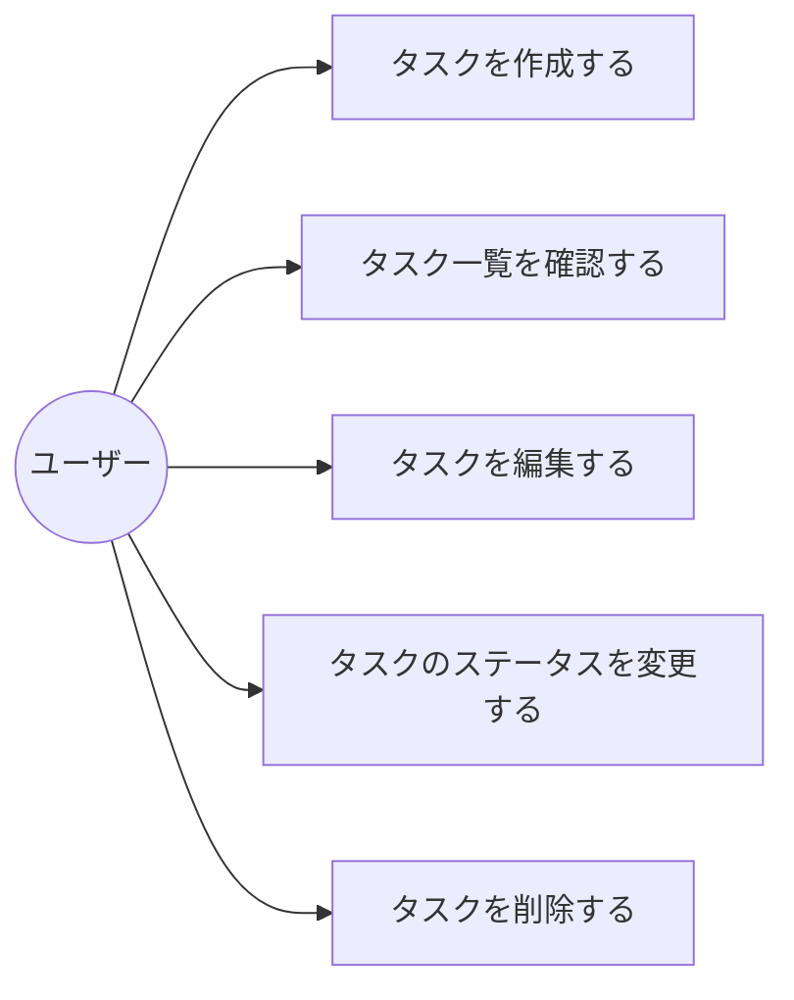
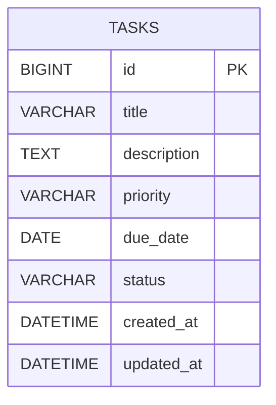

# Trello風タスク管理アプリ

## プロジェクト概要
個人用のタスク管理アプリ。Trelloのようなカンバンボード形式で、タスク情報を入力してボードに表示し、ドラッグ&ドロップで管理する。

## 目的
- 個人のタスク管理を効率的に行う
- GitHubに上げて学習用プロジェクトとして活用

## 対象ユーザー
- 個人ユーザー（自分1人で使用）
- 実行環境：ブラウザ（Web アプリ）

---

## タスク入力項目

### 必須項目
- **タイトル** - タスクの名前（入力必須）

### 任意項目
- **説明文** - タスクの詳細情報（入力任意）
- **優先度** - 優先度レベル：高 / 中 / 低
- **期限** - タスクの期限日付

---

## ボード構成

タスクを以下の3つの列で管理する：

| 列名 | 説明 |
|------|------|
| **やること** | 新規作成されたタスク、未着手のタスク |
| **進行中** | 現在取り組んでいるタスク |
| **完了** | 完了したタスク |

カードはドラッグ&ドロップで列間を移動できる。

---

## ユースケース

対象ユーザーは個人ユーザー1人のみのため、アクターは「ユーザー」のみ。

| ユースケースID | ユースケース名 | 概要 |
|---|---|---|
| UC-01 | タスクを作成する | ユーザーがタスク入力フォームからタイトル・説明文・優先度・期限を入力し、「やること」列にタスクを追加する |
| UC-02 | タスク一覧を確認する | ユーザーがボード画面を開き、「やること」「進行中」「完了」の各列に並んだタスクカードを確認する |
| UC-03 | タスクを編集する | ユーザーが既存のタスクカードを開き、内容（タイトル・説明文・優先度・期限）を変更する |
| UC-04 | タスクのステータスを変更する | ユーザーがタスクカードをドラッグ&ドロップし、別の列（ステータス）に移動する |
| UC-05 | タスクを削除する | ユーザーがタスクカードの削除操作を行い、不要になったタスクを削除する |



---

## 画面一覧

| 画面ID | 画面名 | 概要 |
|---|---|---|
| SC-01 | ボード画面 | アプリのメイン画面。「やること」「進行中」「完了」の3列でタスクカードを表示し、ドラッグ&ドロップで移動できる |
| SC-02 | タスク追加フォーム | 新規タスクを入力する画面（モーダル表示）。タイトル・説明文・優先度・期限を入力する |
| SC-03 | タスク編集フォーム | 既存タスクの内容を編集する画面（モーダル表示）。タスク追加フォームと同じ入力項目を持つ |

---

## 機能要件

### フェーズ1: 基本機能（最優先）
- [ ] タスク入力フォームを作成（タイトル・説明文・優先度・期限を入力可能）
- [ ] タスク追加ボタンで「やること」列にカードを追加
- [ ] カード表示（タイトル・説明文・優先度・期限を表示）
- [ ] カード削除機能
- [ ] BE APIの基本エンドポイント（タスクのCRUD）を実装
- [ ] BE APIを通じてMySQLにデータを保存・取得

### フェーズ2: ドラッグ&ドロップ（次の優先順位）
- [ ] カードをマウスドラッグで列間移動
- [ ] 移動時にデータ更新・保存

### フェーズ3: 改善・拡張（余裕があれば）
- [ ] 優先度による色分け表示
- [ ] カード編集機能
- [ ] UIの改善・ポーランド

---

## 非機能要件

| 項目 | 要件 |
|------|------|
| **データ保存** | MySQLデータベースに保存（BE経由でCRUD）。ページ更新後もデータが消えない |
| **実行環境** | ブラウザ（Chrome、Firefox等）で動作 |
| **将来拡張** | 後日、クラウド環境へのデプロイに対応可能 |

---

## 技術スタック

| 層 | 技術 |
|-------|------|
| **フロントエンド** | React + Vite |
| **状態管理** | React State (useState/useReducer) |
| **バックエンド** | Java + Spring Boot |
| **データベース** | MySQL |
| **ドラッグ&ドロップ** | `@hello-pangea/dnd` または `dnd-kit`（検討中） |

---

## データ設計

個人ユーザー1人のみで利用するアプリのため、ユーザーを表すテーブルは持たず、タスク（`tasks`）テーブル1つのみで構成する。

### ER図



### テーブル定義

**tasks（タスク）**

| カラム名 | 型 | NULL | 主キー | 説明 |
|---|---|---|---|---|
| id | BIGINT | NOT NULL | PK | タスクID（自動採番） |
| title | VARCHAR(255) | NOT NULL | | タスクのタイトル（必須項目） |
| description | TEXT | NULL | | タスクの説明文（任意項目） |
| priority | VARCHAR(10) | NULL | | 優先度（`HIGH` / `MEDIUM` / `LOW`） |
| due_date | DATE | NULL | | タスクの期限日 |
| status | VARCHAR(20) | NOT NULL | | タスクのステータス（`TODO` / `IN_PROGRESS` / `DONE`）。ボードの列に対応 |
| created_at | DATETIME | NOT NULL | | 作成日時 |
| updated_at | DATETIME | NOT NULL | | 更新日時 |

- `status` はボード構成の3列（やること／進行中／完了）に対応し、ドラッグ&ドロップで列を移動するとこの値が更新される
- `priority` は任意項目のため NULL を許容する

---

## 実装ロードマップ

### フェーズ1: 基本UI構築
- Vite + Reactプロジェクトの初期セットアップ（`npm create vite@latest`）
- Board・Column・Cardコンポーネントの作成
- CSSでレイアウト完成
- Spring Bootプロジェクトの初期セットアップ（Spring Initializr）
- MySQL接続設定（`application.properties`）

### フェーズ2: インタラクション実装
- ドラッグ&ドロップライブラリの導入・実装
- カード追加・削除の基本機能

### フェーズ3: データ永続化
- BE APIとの連携（タスクのCRUD処理）
- MySQLへのデータ保存・取得
- ページ更新時のデータ復元

### フェーズ4: 詳細機能
- カード詳細情報（説明、期限、色分け）の実装
- 編集機能の完成

### フェーズ5: 改善・ポーランド
- ユーザー体験の向上
- バグ修正・最適化

---

## プロジェクト構成（予定）

```
taskmanagement/
├── README.md（このファイル）
├── frontend/
│   ├── index.html
│   ├── package.json
│   ├── vite.config.js
│   └── src/
│       ├── main.jsx
│       ├── App.jsx
│       ├── components/
│       │   ├── Board.jsx
│       │   ├── Column.jsx
│       │   └── Card.jsx
│       ├── hooks/
│       │   └── useTaskApi.js
│       └── styles/
│           └── style.css
└── backend/
    ├── pom.xml
    └── src/
        └── main/
            ├── java/
            │   └── com/example/taskmanagement/
            │       ├── TaskManagementApplication.java
            │       ├── controller/
            │       │   └── TaskController.java
            │       ├── service/
            │       │   └── TaskService.java
            │       ├── repository/
            │       │   └── TaskRepository.java
            │       └── entity/
            │           └── Task.java
            └── resources/
                └── application.properties
```

---

## 注釈
- 実装を進める中で、機能が追加・変更される可能性がある
- GitHubで学習用プロジェクトとして公開予定
