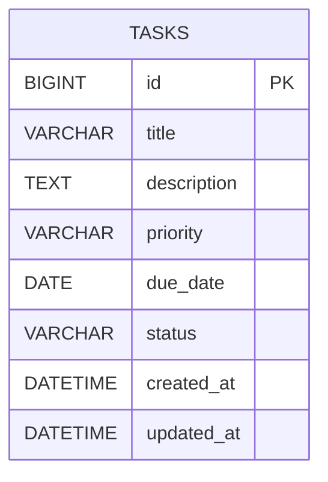

# データ設計

個人ユーザー1人のみで利用するアプリのため、ユーザーを表すテーブルは持たず、タスク（`tasks`）テーブル1つのみで構成する。

## ER図

## テーブル定義

**tasks（タスク）**

| カラム名 | 型 | NULL | 主キー | 説明 |
|---|---|---|---|---|
| id | BIGINT | NOT NULL | PK | タスクID（自動採番） |
| title | VARCHAR(255) | NOT NULL | | タスクのタイトル（必須項目） |
| description | TEXT | NULL | | タスクの説明文（任意項目） |
| priority | VARCHAR(10) | NULL | | 優先度（`HIGH` / `MEDIUM` / `LOW`） |
| due_date | DATE | NULL | | タスクの期限日 |
| status | VARCHAR(20) | NOT NULL | | タスクのステータス（`TODO` / `IN_PROGRESS` / `DONE`）。ボードの列に対応 |
| created_at | DATETIME | NOT NULL | | 作成日時 |
| updated_at | DATETIME | NOT NULL | | 更新日時 |

- `status` はボード構成の3列（やること／進行中／完了）に対応し、ドラッグ&ドロップで列を移動するとこの値が更新される
- `priority` は任意項目のため NULL を許容する
