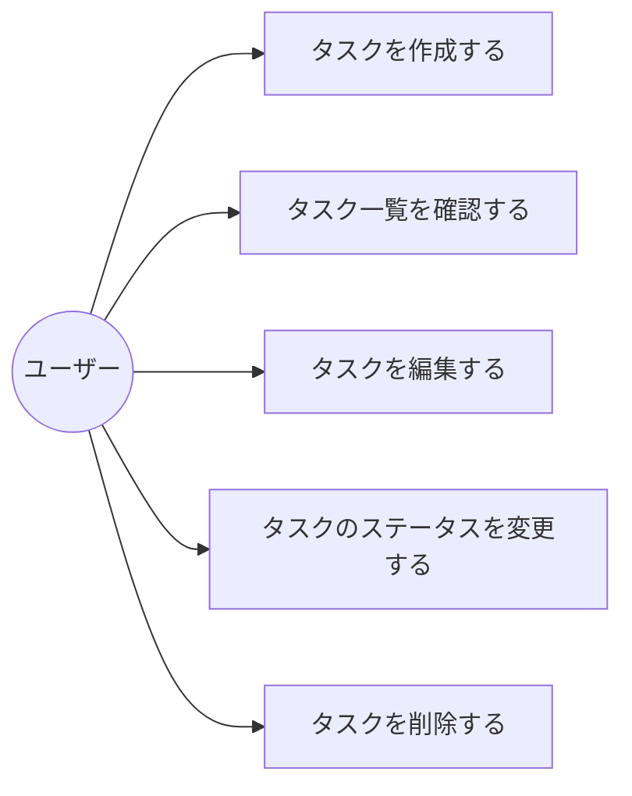

# 要件定義

## 目的
- 個人のタスク管理を効率的に行う
- GitHubに上げて学習用プロジェクトとして活用

## 対象ユーザー
- 個人ユーザー（自分1人で使用）
- 実行環境：ブラウザ（Web アプリ）

---

## タスク入力項目

### 必須項目
- **タイトル** - タスクの名前（入力必須）

### 任意項目
- **説明文** - タスクの詳細情報（入力任意）
- **優先度** - 優先度レベル：高 / 中 / 低
- **期限** - タスクの期限日付

---

## ボード構成

タスクを以下の3つの列で管理する：

| 列名 | 説明 |
|------|------|
| **やること** | 新規作成されたタスク、未着手のタスク |
| **進行中** | 現在取り組んでいるタスク |
| **完了** | 完了したタスク |

カードはドラッグ&ドロップで列間を移動できる。

---

## ユースケース

対象ユーザーは個人ユーザー1人のみのため、アクターは「ユーザー」のみ。

| ユースケースID | ユースケース名 | 概要 |
|---|---|---|
| UC-01 | タスクを作成する | ユーザーがタスク入力フォームからタイトル・説明文・優先度・期限を入力し、「やること」列にタスクを追加する |
| UC-02 | タスク一覧を確認する | ユーザーがボード画面を開き、「やること」「進行中」「完了」の各列に並んだタスクカードを確認する |
| UC-03 | タスクを編集する | ユーザーが既存のタスクカードを開き、内容（タイトル・説明文・優先度・期限）を変更する |
| UC-04 | タスクのステータスを変更する | ユーザーがタスクカードをドラッグ&ドロップし、別の列（ステータス）に移動する |
| UC-05 | タスクを削除する | ユーザーがタスクカードの削除操作を行い、不要になったタスクを削除する |

